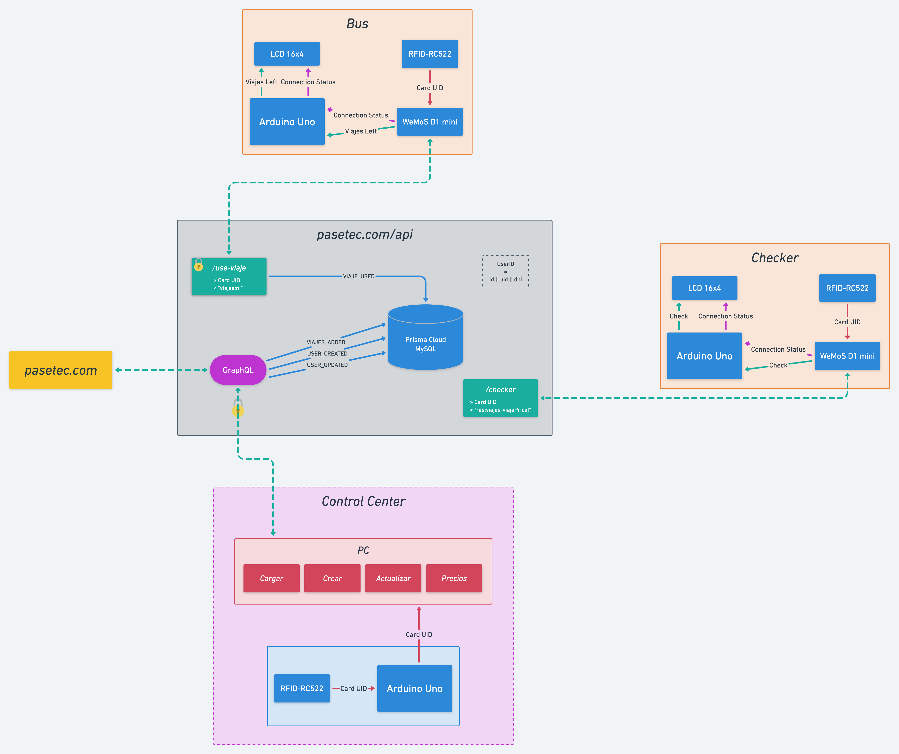

# Pase-Tec

An electronic system of scholar transport.

## How does it work?

The entire system can be split into three "independent" parts:

- **[Arduino](/arduino)**: Here goes all the code inside Arduinos and other electronics.
- **[Control Center](/control-center)**: The Control Center is like a dashboard for all the data.
- **[Web](/web)**: It can be sub-divided in two more parts (and it's all together for practicality):
  - **API**: all the endpoints that get or modify data from the database;
  - **Webpage**: where a user can see their information.

### Data-flow

