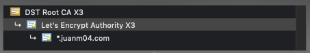

[English](GET_CACERT.md) | Español


Cuando hablamos de certificados SSL, siempre hay una _cadena de certificación_: el certificado raíz, los intermediarios y el del usuario final.



Para generar el `CACert.ino` necesitamos el certificado raíz (Certificate Authority or CA). ¿Por qué? Porque a) este expira en mucho tiempo, por lo que tendremos que actualizarlo una vez cada muchos años (eso es lo que nuestra PC hace) y b) hay una Cadena de Validez que puede validar el el certificado del usuario final usando el CA. Entonces, ¿cómo lo obtenemos?

### Windows

- En Chrome, andá a tu dominio y cliqueá el candado a lado de la URL.
- Cliqueá _Certificado_, _Ruta de Certificación_, doble clic al CA.
- Luego _Detalles_, _Copiar al Archivo..._ y un asistente aparecerá.
- Exportalo como _DER binario codificado X.509 (.CER)_.
- Corré este script de [Python](https://www.python.org/):
```bat
$ cd pasetec\arduino
$ python .get_cacert\cer_to_hex.py ruta\a\tu\Raíz.cer bus\wemos\CACert.ino
```

### MacOS

- En Chrome, andá a tu dominio y cliqueá el candado a lado de la URL.
- Cliqueá _Certificado_ y fijate que CA está usando.
- Abrí _Acceso a Llaveros_, luego andá a _Raíz del sistema_ y seleccioná tu CA.
- Clic derecho, _Exportar_, exportalo como .CER.
- Corré este script de [Python](https://www.python.org/):
```bash
$ cd pasetec/arduino
$ python .get_cacert/cer_to_hex.py ~/ruta/a/tu/Raíz.cer bus/wemos/CACert.ino
```

### Linux

Debería ser como en MacOS pero, si estás usando Linux, sabés qué estás haciendo.