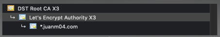

English | [Español](GET_CACERT.es.md)

When talking about SSL certificates, there is always a _certificate chain_: the root certificate, the intermediates one and the end-user one.



To generate the `CACert.ino` we need the root certificate (Certificate Authority or CA). ¿Why? Because a) it expires in a long time, so we just have to update it once every several years (that's what our PC does) and b) there is a Trust Chain that can validate the end-user certificate using the CA. So, ¿how do we get it?

### Windows

- In Chrome, go to your domain and click the lock next to the URL.
- Click _Certificate_, _Certification Path_, double click to the CA.
- Then _Details_, _Copy to File..._ and a wizard will show up.
- Export it as _DER encoded binary X.509 (.CER)_.
- Run this [Python](https://www.python.org/) script:
```bat
$ cd pasetec\arduino
$ python .get_cacert\cer_to_hex.py path\to\your\Root.cer bus\wemos\CACert.ino
```

### MacOS

- In Chrome, go to your domain and click the lock next to the URL.
- Click _Certificate_ and see what CA is using.
- Open _Keychain Access_, then to _System Roots_ and select your CA.
- Right click, _Export_, export it as .CER.
- Run this [Python](https://www.python.org/) script:
```bash
$ cd pasetec/arduino
$ python .get_cacert/cer_to_hex.py ~/path/to/your/Root.cer bus/wemos/CACert.ino
```

### Linux

It should be like using MacOS but, if you are using Linux, you know what you are doing.