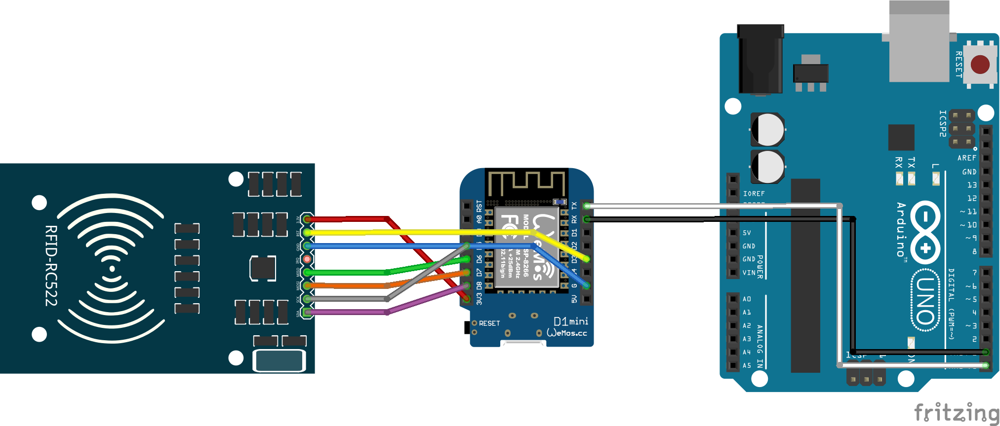
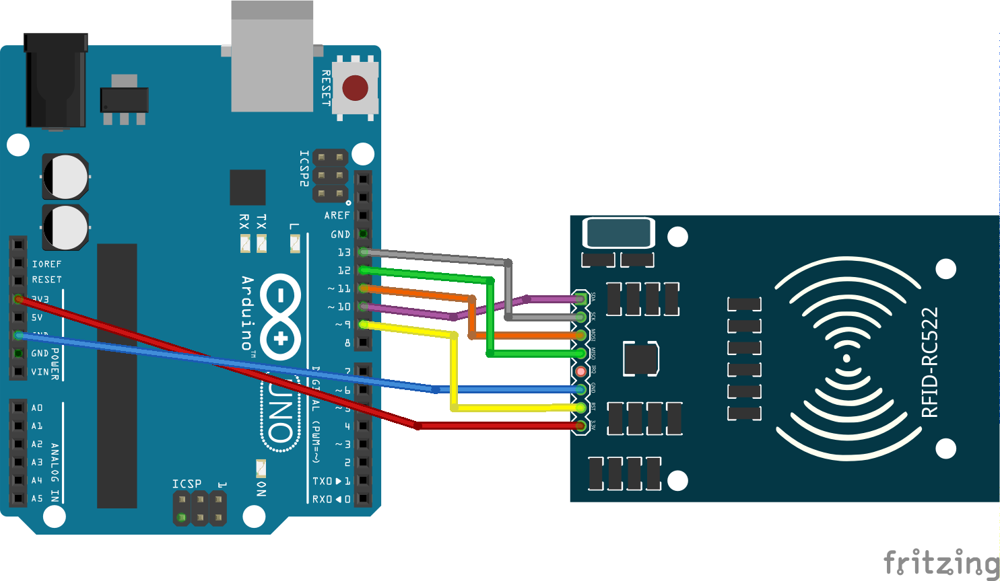

[English](README.md) | Español

# PaseTec – _Arduino_

Cajas de Arduino.

## Preparación

Necesitás tener el [Arduino IDE](https://www.arduino.cc/en/main/software) instalado.

#### Placas ESP8266

- Iniciá el Arduino IDE y andá a _Preferencias_.
- Ingresá `https://arduino.esp8266.com/stable/package_esp8266com_index.json` en _Gestor de URLs Adicionales de Tarjetas_. (Podés poner múltiples URL separándolas con comas).
- Abrí _Gestor de tarjetas..._ desde el  menu _Herramientas > Placa_ e instalá la plataforma `esp8266`.
- Ahora tenés disponible la placa del WeMos D1 mini.

#### Librería MFRC522

- Iniciá el Arduino IDE y andá a _Programa > Incluir Librería > Administrar Bibliotecas..._.
- Buscá `MFRC522` e instalalo.
- Ahora podés usarla.

#### `conf.h`

Dentro de `arduino/*/wemos/`, necesitarás crear un archivo `conf.h`. Es como un dotenv para Arduino, y debe verse así:

```c++
#define NETWORK_SSID      "MiRedWifi"
#define NETWORK_PASSWORD  "C0ntr4seÑa"
#define HOST              "ejemplo.com"
#define SECRET            "secreto-api"
```

#### `CACert.ino`

Dentro de `arduino/*/wemos/`, necesitarás crear un archivo `CACert.ino`. Ahí irá el certificado raíz SSL de tu host. [Acá](.get_cacert/GET_CACERT.es.md) hay una guía para obtenerlo.

### Estructura de Archivos

```
arduino/
|-- bus/
  |-- uno/
  |-- wemos/
|-- control-center/
  |-- uno/
```

- **`bus/uno/`**: Contiene el códiga para el Arduino Uno que va en el colectivo
- **`bus/wemos/`**: Contiene el códiga para el WeMoS D1 mini que va en el colectivo
- **`control-center/uno/`**: Contiene el códiga para el Arduino Uno que va en el Centro de Control

## _Placas y Cables_

### Colectivo y Consultor

Arduino Uno, WeMoS D1 mini, RFID-RC522, LCD 16x4 y Buzzer/Zumbador/Coso-que-hace-ruido.
El Consultor es igual al Colectivo pero sin el buzzer.



### Centro de Control

Arduino Uno y RFID-RC522.



## Notas

No sé por qué, pero cuando enciendas un Uno y un WeMoS que estén conectados, el WeMoS **debe** ser encendido antes.