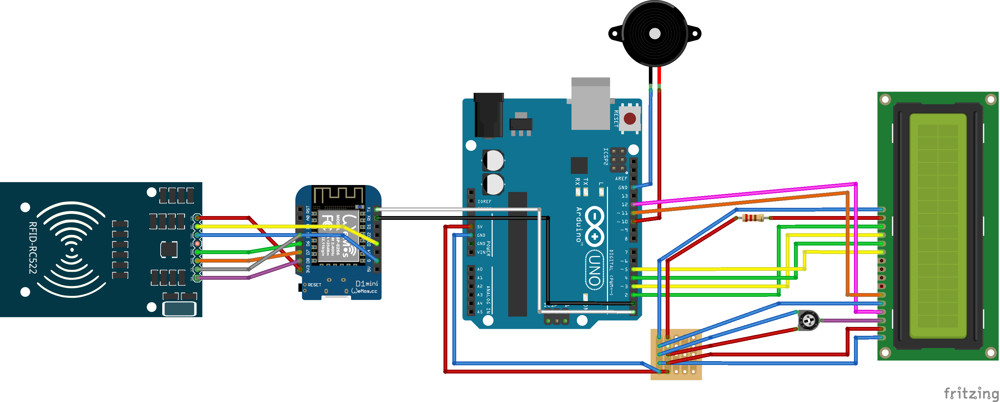

English | [Español](README.es.md)

# PaseTec – _Arduino_

Arduino Boxes.

## Setup

You'll need the [Arduino IDE](https://www.arduino.cc/en/main/software) installed.

#### ESP8266 Boards

- Start the Arduino IDE and open _Preferences_.
- Enter `https://arduino.esp8266.com/stable/package_esp8266com_index.json` in _Additional Board Manager URLs_. (You can put multiple URLs separated by commas).
- Open _Boards Manager_ from _Tools > Board_ menu and install `esp8266` platform.
- Now you are able to select it when uploading to the WeMos D1 mini.

#### MFRC522 Library

- Start the Arduino IDE and go to _Sketch > Include Library > Manage Libraries..._.
- Search `MFRC522` and install it.
- Now you are able to use it.

#### `conf.h`

In `arduino/*/wemos/`, you'll need to create a `conf.h` file. Is like a dotenv for Arduino, and should look like this:

```c++
#define NETWORK_SSID      "MyWiFiNetwork"
#define NETWORK_PASSWORD  "coolP44SW00RD"
#define HOST              "example.com"
#define SECRET            "api-secret"
```

#### `CACert.ino`

In `arduino/*/wemos/`, you'll need a `CACert.ino`. There goes the root SSL certificate of your host. [Here](.get_cacert/GET_CACERT.md) is a guide to get it.

### File Structure

```
arduino/
|-- bus/
|-- checker
|-- control-center/
```

## _Boards and Wires_

### Bus and Checker

Arduino Uno, WeMoS D1 mini, RFID-RC522, LCD 16x4 & Buzzer.
The Checker is like the Bus without the buzzer.



### Control Center

Arduino Uno & RFID-RC522.


## Notes

I don't know why, but when you turn on both an _Uno_ and a _WeMoS_ that are connected, the _WeMoS_ **must** be on before or at the same time as the _Uno_.